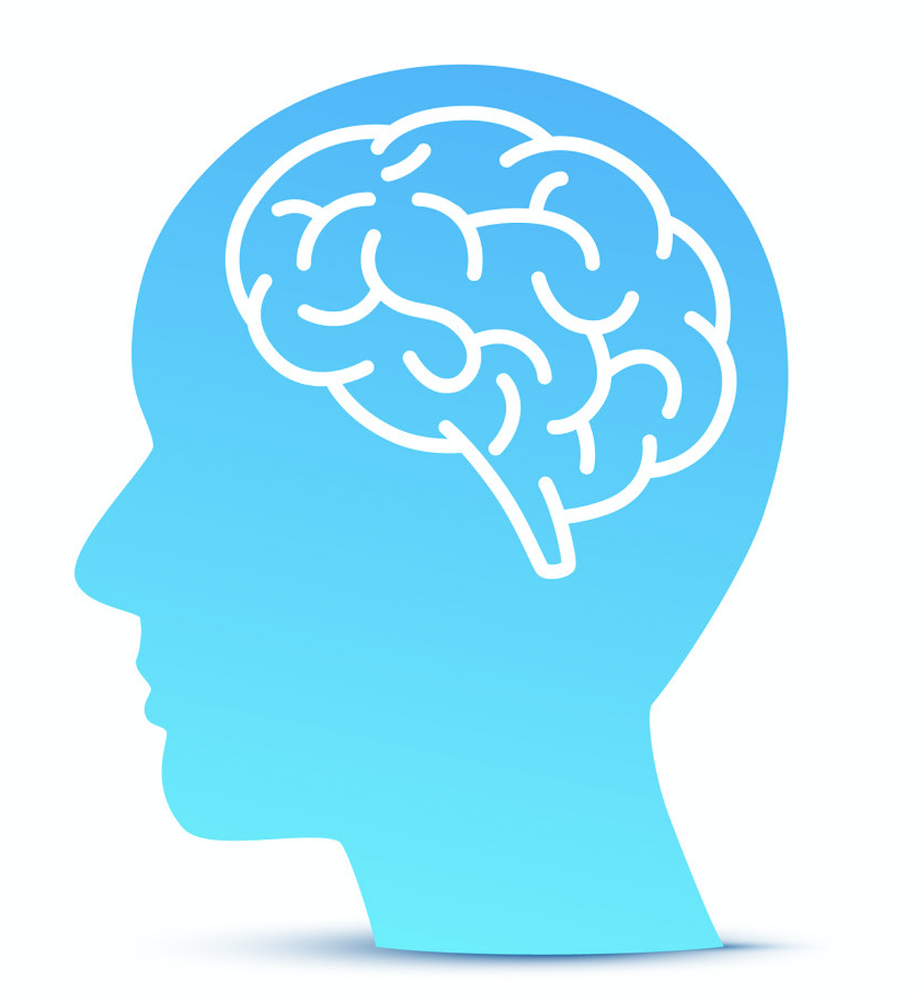

  My main drive to major in Computer Science at the University of Hawai'i at Mānoa was learning how
  to do website development.  Little did I know how important understanding the bigger picture of design frameworks
  would be, especially when dealing with my future in website development.
  
## What am I thinking? 
  
  The idea of having so many design frameworks to start from is very overwhelming until you make your decision. This
  was the case of my final project in ICS314 at the University of Hawai'i at Mānoa.
  
  ... but, there are many benefits to uding UI frameworks such as Semantic UI. (1) They are very easy to get rolling,
  (2) it's just really nice to look at, (3) code is reliable and tested and (4) help is very easy to get when using
  UI frameworks.
  
  Just the thought of code being too easy freaks me out, that's why I prefer coding raw HTML and CSS.

