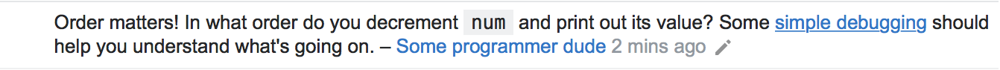
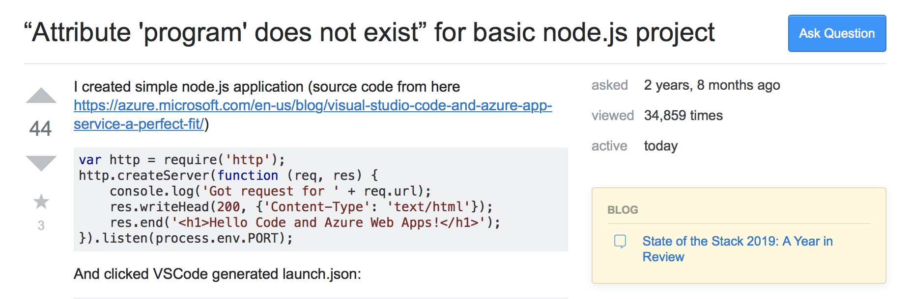
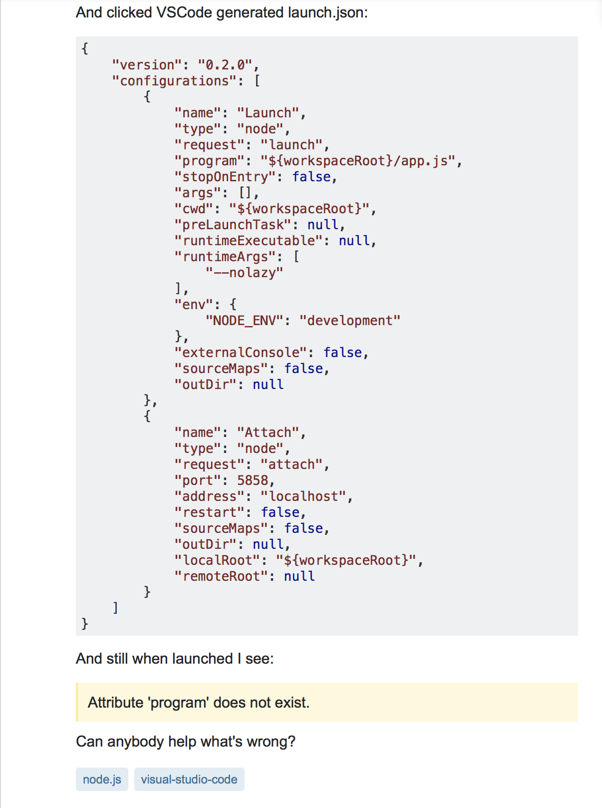

My first impressions of ESLint with IntelliJ? Wow, great, now I can really focus on my coding format, but once I started to actually program with IntelliJ, I found that I got frustrated with how difficult it was trying to get that green checkmark. Despite this, it's not all for nothing.
  
## "...Where Developers Learn, Share, & Build Careers"
   
Stack Overflow is a privately held website, the flagship site of the Stack Exchange Network, created in 2008 by Jeff Atwood and Joel Spolsky. It features questions and answers on a wide range of topics in computer programming. The way it works is Stack Overflow serves as a platform for users to ask and answer questions, and, through membership and active participation, to vote questions and answers up or down and edit questions and answers in a fashion similar to a wiki or Digg.

## The Not so Good, Bad, & Ugly

To the left is an example of a poorly worded and scary looking wall of text. Somewhere in that paragraph is a fellow programmer asking for help, too bad no one can figure out what they want. Can you spot the question this user is asking?

...and with a poorly worded help threat, comes a comment that could have been an answer with more information given in the original post.

## That's more like it!

Let's show some love for this user! With a title like that, it's no wonder this question has been viewed 34,859 times! To the right is an example of a great question. Short and sweet and with all the basic information needed to help this user with no stress at all, this is a perfect example of how one should ask for help.

This particular post gained some major fame since it has been posted 2 years and 8 months ago. With 44 upvotes on the problem itself, this user struck a pot of gold with the amount of help he received...

What did this user do differently?.. (1) The title of the forum post is not worded poorly. (2) The user provides everything a fellow programmer would need to solve the problem. (3) The post is very friendly and inviting, no scary walls of text!

Can you spot any more differences between the two?

8 answers! The top answer including verification, 38 upvotes, and great content, just what this user needed!

On top of the 8 answers, there are multiple comments to make sure that the top answer is perfect. From a fellow Stack Overflow user, to me, there is no way to improve this answer!

## So what then?

Let's all remember that if you ask a great question, you will receive great answers but let's not forget, that if you ask a bad question, you will receive bad answers.
