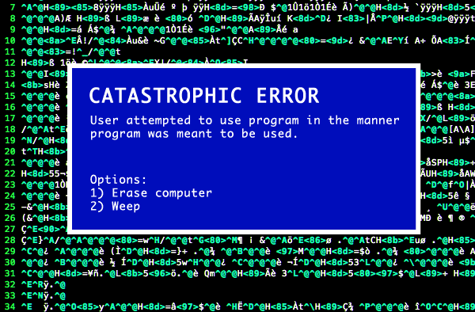
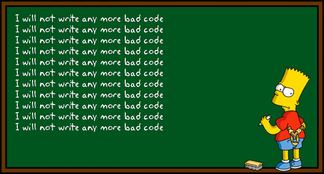

My first impressions of ESLint with IntelliJ? Wow, great, now I can really focus on my coding format, but once I started to actually program with IntelliJ, I found that I got frustrated with how difficult it was trying to get that green checkmark. Despite this, it's not all for nothing.
  
## "...Programming Sucks" - Programmer
   
ESLint is an open source JavaScript linting utility originally created by Nicholas C. Zakas in June 2013. Code linting is a type of static analysis that is frequently used to find problematic patterns or code that doesn’t adhere to certain style guidelines. There are code linters for most programming languages, and compilers sometimes incorporate linting into the compilation process.

## another. error.

So what do I do when I get an error? I google and google away until I find what is wrong with my code. I get it, this can be tedious but, at least we won't be missing any semicolons anymore. And with the way ESLint sets the formatting, the end result is a very beautiful layout...

## That's more like it!

Let's show some love for this user! With a title like that, it's no wonder this question has been viewed 34,859 times! To the right is an example of a great question. Short and sweet and with all the basic information needed to help this user with no stress at all, this is a perfect example of how one should ask for help.

This particular post gained some major fame since it has been posted 2 years and 8 months ago. With 44 upvotes on the problem itself, this user struck a pot of gold with the amount of help he received...

What did this user do differently?.. (1) The title of the forum post is not worded poorly. (2) The user provides everything a fellow programmer would need to solve the problem. (3) The post is very friendly and inviting, no scary walls of text!

Can you spot any more differences between the two?

8 answers! The top answer including verification, 38 upvotes, and great content, just what this user needed!

On top of the 8 answers, there are multiple comments to make sure that the top answer is perfect. From a fellow Stack Overflow user, to me, there is no way to improve this answer!

## So what then?

Let's all remember that if you ask a great question, you will receive great answers but let's not forget, that if you ask a bad question, you will receive bad answers.
