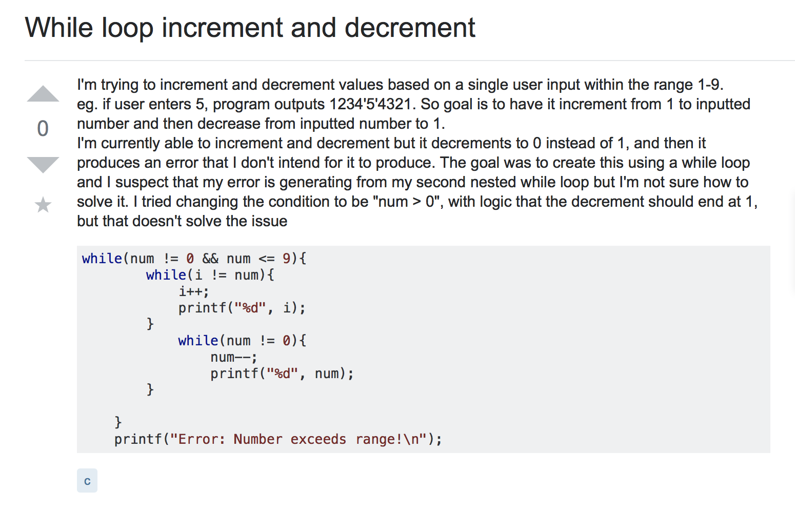
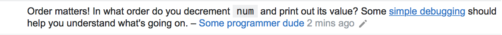
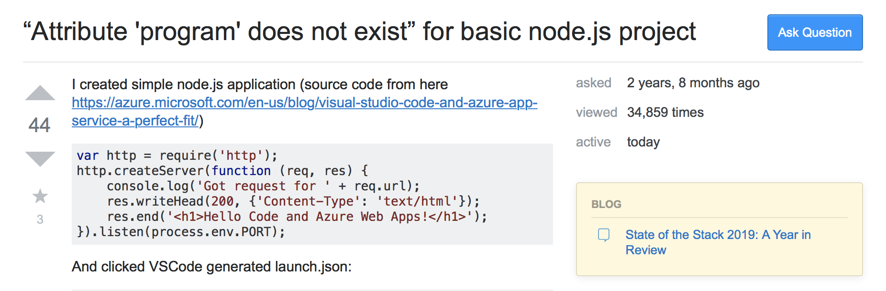
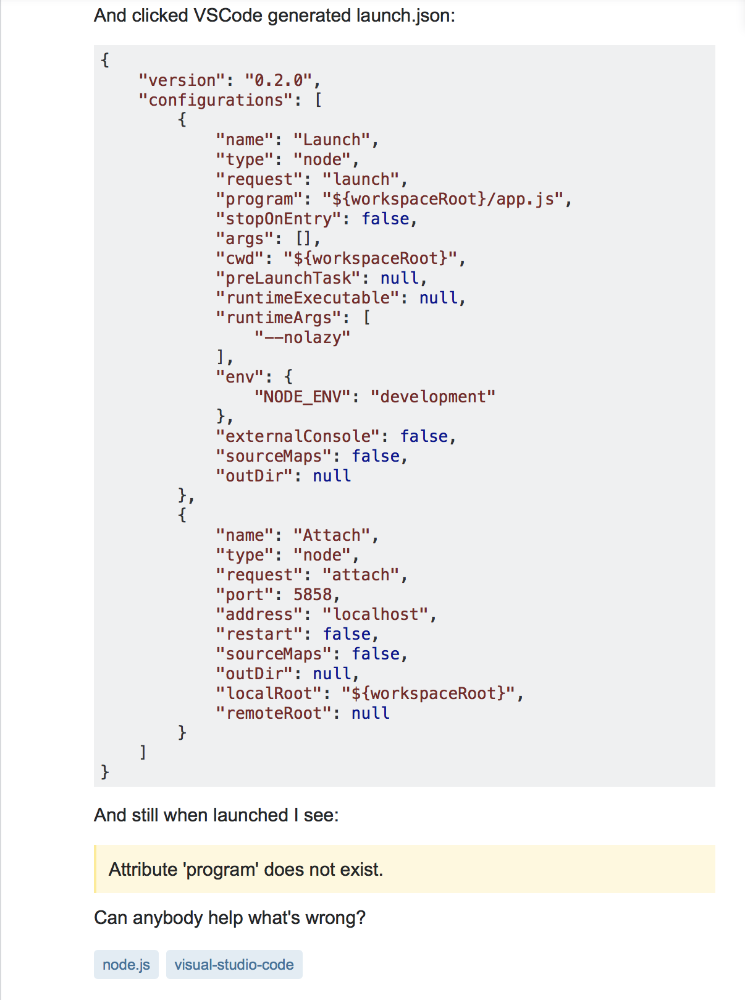
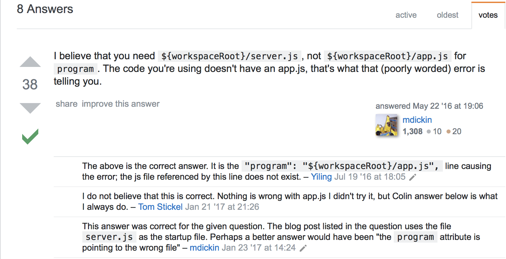

Everyone who has been on a computer programming forum website knows how rough users can be with their replies and comments but, they do so with good reason... A lot of these nasty replies can be prevented with a better understanding on how to ask for help. Question is, HOW DO YOU ask for help?
  
## "...Where Developers Learn, Share, & Build Careers"
   
Stack Overflow is a privately held website, the flagship site of the Stack Exchange Network, created in 2008 by Jeff Atwood and Joel Spolsky. It features questions and answers on a wide range of topics in computer programming. The way it works is Stack Overflow serves as a platform for users to ask and answer questions, and, through membership and active participation, to vote questions and answers up or down and edit questions and answers in a fashion similar to a wiki or Digg.

## The Not so Good, Bad, & Ugly

To the left is an example of a poorly worded and scary looking wall of text. Somewhere in that paragraph is a fellow programmer asking for help, too bad no one can figure out what they want. Can you spot the question this user is asking?

...and with a poorly worded help threat, comes a comment that could have been an answer with more information given in the original post.

## Now, that's more like it!

Let's show some love for this user! With a title like that, it's no wonder this question has been viewed 34,859 times! Short and sweet and with all the basic information needed to help this user with no stress at all, this is a perfect example of how one should ask for help.

With 44 upvotes on the problem itself, this user struck a pot of gold with the amount of help he received...

8 answers! The top answer including verification, 38 upvotes, and great content, just what this user needed!

## So what then?

Let's all remember that if you ask a great question, you will receive great answers but let's not forget, that if you ask a bad question, you will receive bad answers.
