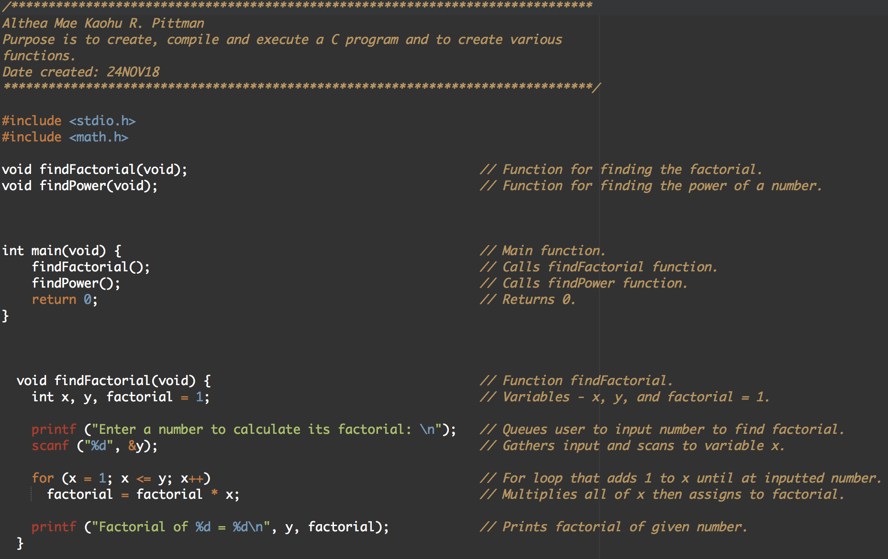
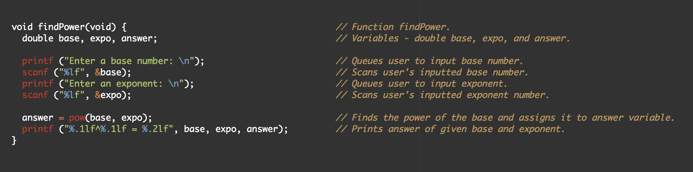

I have always heard stories about C and C++ programming but I never got the chance to use it until I took ICS 212 at the University of Hawai'i at Mānoa in the fall 2018 semester. This is one of the first programs I made for a homework assignment.

## Different, but not that different.

As a reflection, I did not think much of the changes from Java to C. Yes, I've heard the stories between C and C++ but I chose not to go into the language with a lot to think about. I just chose to adapt.

