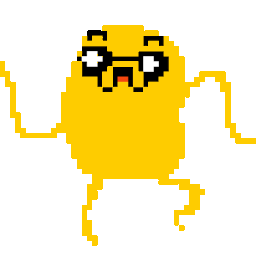

<div class="ui small rounded images">
  
  
  
</div>

"Olympic Runner" is a game I created in the ICS introduction class at the University of Hawai'i at Mānoa, this was the first project for the class. Our task was to create a game that took user input, by interchanging the keys 'a' and 's,' the user's character would go further down the track. The goal of the game was to beat the other characters to the finish line.

## Characters...

Sora 

Wow, what a blast from the past! It is nice to reflect on my past achievements and compare myself to how I was back then. I remember thinking this project was very hard for me and I spent hours in the ICSpace at my university asking for help. I'm sure my TA at the time was fed up with seeing me all the time!

```js
byte ADCRead(byte ch)
{
    word value;
    ADC1SC1 = ch;
    while (ADC1SC1_COCO != 1)
    {   // wait until ADC conversion is completed   
    }
    return ADC1RL;  // lower 8-bit value out of 10-bit data from the ADC
}
```

You can learn more at the [UH Micromouse Website](http://www-ee.eng.hawaii.edu/~mmouse/about.html).


